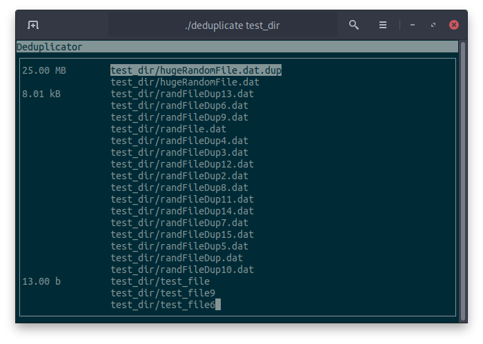

# deduplicate

deduplicate is a curses based file dedulicator which scans 
the beginning and end of files to find duplicates.

# Compiling deduplicate

Simply type `make` to compile deduplicate using the system's default
C++ compiler